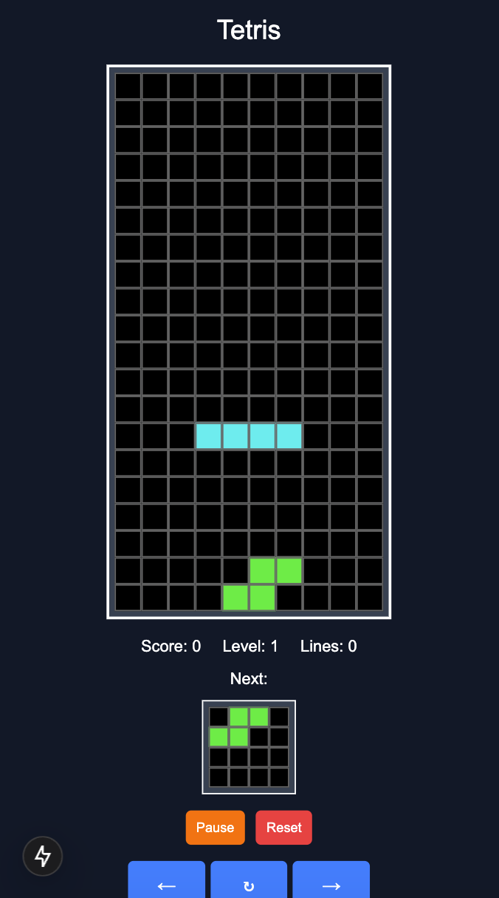
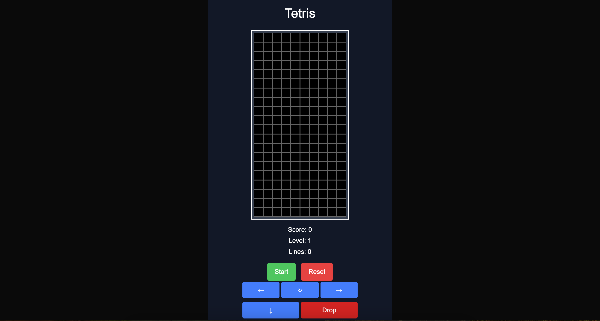
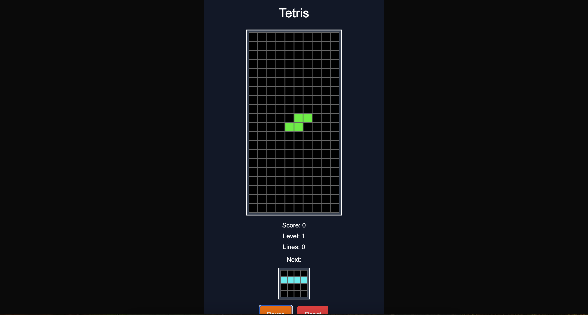

# 🎮 Tetris Game

モダンなWebテクノロジーで作られたクラシックなテトリスゲームです。レスポンシブデザインでデスクトップ、タブレット、スマートフォンすべてに対応しています。



## ✨ 特徴

- **完全なテトリス体験**: 本格的なテトリスゲームロジック
- **レスポンシブデザイン**: すべてのデバイスで最適化された表示
- **タッチ操作対応**: スマートフォンでの快適なゲームプレイ
- **キーボード操作**: 従来のPC操作にも対応
- **リアルタイムスコア**: スコア、レベル、ライン数の追跡
- **Next Piece表示**: 次のピースを事前に確認可能

## 🕹️ 操作方法

### キーボード操作
- `←` `→` : ピースを左右に移動
- `↓` : ピースを高速落下
- `↑` : ピースを回転
- `P` : ゲームをポーズ/再開

### タッチ操作
- 画面上のボタンで直感的に操作
- `←` `→` : 左右移動
- `↻` : 回転
- `↓` : 高速落下

## 🎯 ゲームのルール

1. **ピースの配置**: 上から落ちてくるテトリミノを配置
2. **ライン消去**: 横一列が埋まるとラインが消去され、スコア獲得
3. **レベルアップ**: 10ライン消去毎にレベルが上がり、落下速度が増加
4. **ゲームオーバー**: ピースが上端まで積み上がるとゲーム終了

## 📱 スクリーンショット

### ゲーム開始画面


### ゲームプレイ中


### デスクトップ版


## 🚀 技術スタック

- **Next.js 15** - React フレームワーク
- **TypeScript** - 型安全な開発
- **Tailwind CSS 4** - モダンなスタイリング
- **Zustand** - 軽量な状態管理
- **React Hooks** - モダンなReact開発

## 🛠️ 開発・実行

### 必要条件
- Node.js 18.0.0以上
- npm または yarn

### インストール・実行
```bash
# 依存関係のインストール
npm install

# 開発サーバーの起動
npm run dev

# 本番ビルド
npm run build

# 本番サーバーの起動
npm start
```

### 開発モード
```bash
npm run dev
```
開発サーバーが起動し、[http://localhost:3000](http://localhost:3000)でアクセス可能になります。

## 🎮 ゲームの特徴的な実装

### 状態管理
- Zustandを使用した効率的な状態管理
- ゲーム状態、スコア、レベルの一元管理

### ゲームロジック
- 正確な衝突判定システム
- 効率的なライン消去アルゴリズム
- レベル別落下速度調整

### UI/UX
- レスポンシブデザインによる全デバイス対応
- タッチ操作とキーボード操作の両立
- 直感的なゲームコントロール

## 📄 ライセンス

このプロジェクトはオープンソースです。

---

🎮 **今すぐプレイして、高スコアを目指そう！**